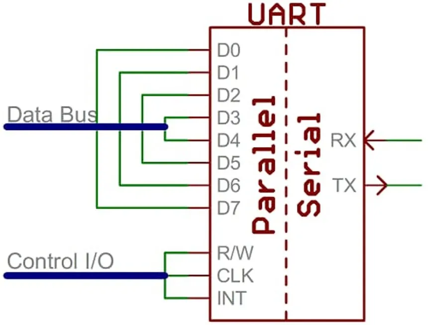
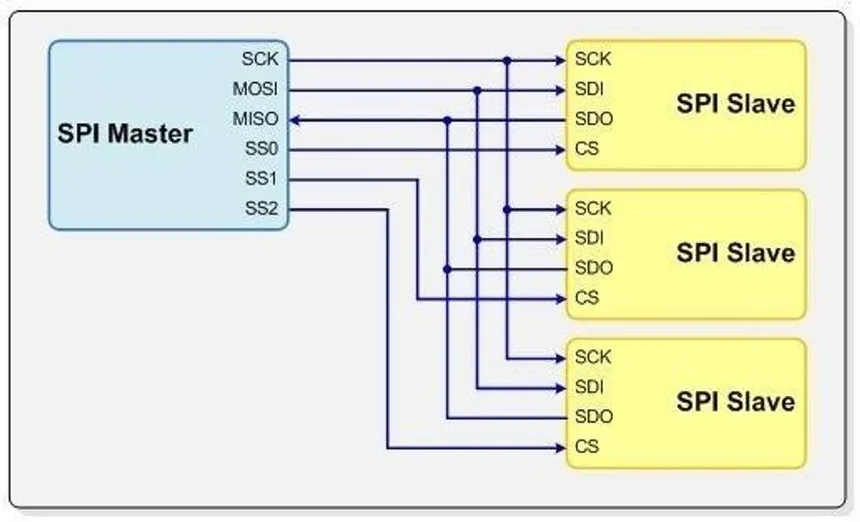
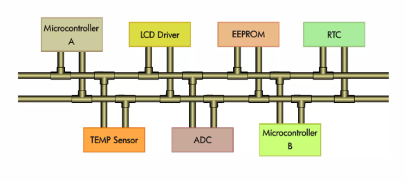

# Communication Protocols in Verilog

This repository contains implementations of three widely-used communication protocols—**UART**, **SPI**, and **I2C**—written in Verilog. These protocols are essential for embedded systems, FPGA, and ASIC designs, and the repository aims to provide modular, reusable code that can be easily integrated into hardware projects.

---

## Table of Contents

- [UART (Universal Asynchronous Receiver-Transmitter)](#uart)
- [SPI (Serial Peripheral Interface)](#spi)
- [I2C (Inter-Integrated Circuit)](#i2c)
---

## UART (Universal Asynchronous Receiver-Transmitter)

  

### Overview:
UART is a simple, asynchronous serial communication protocol where data is transmitted bit by bit over a single communication line. It is widely used for serial data transfer between devices and is ideal for applications requiring low-speed communication.

### Key Features:
- **Asynchronous Communication**: No clock is needed for synchronization.
- **Full-Duplex**: Data can be sent and received simultaneously.
- **Adjustable Baud Rate**: Supports flexible communication speed.

### Use Cases:
UART is commonly used for:
- Communication with peripheral devices like sensors or GPS modules.
- Debugging and development purposes in embedded systems.

### Contents in this Repository:
- **UART Transmitter and Receiver Modules**: With configurable baud rates and parity.
- **Testbenches**: For validation and simulation of data transmission and reception.

---

## SPI (Serial Peripheral Interface)

  

### Overview:
SPI is a synchronous, high-speed serial communication protocol. It uses a master-slave architecture, where a single master controls multiple peripheral devices (slaves) via four main lines: **MOSI** (Master Out Slave In), **MISO** (Master In Slave Out), **SCK** (Clock), and **SS** (Slave Select).

### Key Features:
- **Synchronous Communication**: Data transfer is synchronized with the clock signal.
- **Full-Duplex**: Allows simultaneous data transmission and reception.
- **Multi-Slave Support**: Multiple peripheral devices can be controlled by the master.

### Use Cases:
SPI is suitable for high-speed communication with:
- Sensors (ADC, DAC, etc.)
- Memory devices (EEPROM, Flash)
- Display interfaces and more.

### Contents in this Repository:
- **SPI Master and Slave Modules**: With support for multiple slave devices.
- **Clock Configuration**: Configurable polarity and phase for SCK.
- **Testbenches**: To simulate master-slave communication.

---

## I2C (Inter-Integrated Circuit)

### Overview:
I2C is a two-wire, multi-master, multi-slave synchronous serial communication protocol. It uses only two lines: **SDA** (Serial Data) and **SCL** (Serial Clock), making it an efficient option for communication between low-speed peripherals and microcontrollers.

### Key Features:
- **Two-Wire Interface**: Reduces the number of required pins for communication.
- **Multi-Master and Multi-Slave**: Multiple devices can communicate on the same bus.
- **Addressing**: Devices are identified by unique 7-bit or 10-bit addresses.

### Use Cases:
I2C is ideal for:
- Communication between microcontrollers and sensors, EEPROMs, and RTCs.
- Low-speed peripherals like temperature sensors, RTCs, and other embedded components.

### Contents in this Repository:
- **I2C Master and Slave Modules**: With support for multi-device communication.
- **Addressing**: Configurable addressing modes (7-bit and 10-bit).
- **Testbenches**: To validate master-slave communication.

---

